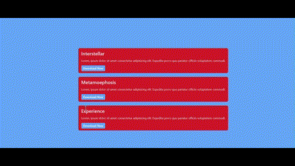
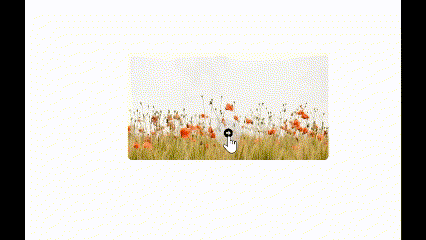
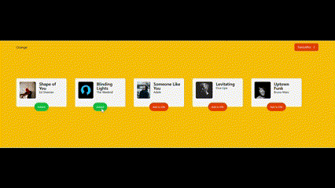
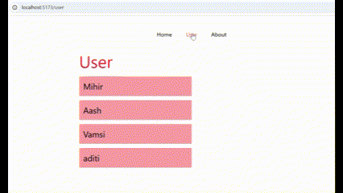
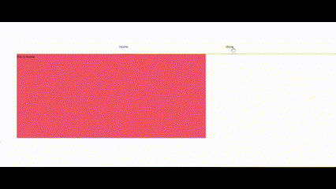

# React Learning Journey

## 📌 Notes  
[Click here to view my notes](https://docs.google.com/document/d/1rkSASdPamr5FRX1avfhyZmFEJljJLkW7mJkdrKRA0F4/edit?usp=sharing)  

 A collection of React projects demonstrating various concepts and implementations.
This repository contains various React projects focusing on different fundamental and advanced concepts.
Below is a breakdown of each project along with the key concepts learned.


## Projects

### 1. React Simple Cards [View Repository](https://github.com/Mihirpatel6996/react-simple-cards)



**Concepts Covered:**
- Component creation and export
- Props and state management
- Event handling (onClick events)
- JSX syntax and mapping arrays

### 2. React Simple Carousel [View Repository](https://github.com/Mihirpatel6996/react-simple-carousel)



**Key Features:**
- Smooth image transition animations
- Responsive design
- Click-based navigation
- Custom styling with Tailwind CSS

### 3. React Social Cards [View Repository](https://github.com/Mihirpatel6996/react-social-cards)


**Concepts Covered:**
1. Basic Props
   - Simple prop passing with PropsDemo component
   - Text and button rendering
   - Basic component reusability

2. Props with Styling
   - Dynamic styling using props (PropswithColors)
   - Tailwind CSS integration
   - Conditional class application

3. Card Components
   - Basic Card: Static implementation, image/name display, alert-based friend addition
   - Advanced Card: Dynamic state management, toggle-based friend status

4. State Management
   - useState hook implementation
   - State lifting
   - Parent-child component communication

### 4. React Song Card Manager [View Repository](https://github.com/Mihirpatel6996/react-song-card-manager)



**Key Learning Points:**
1. React State Management
   - useState hook for music list data
   - State updates through callback functions

2. Component Architecture
   - Parent-Child component communication
   - Props passing and destructuring

3. TailwindCSS Usage
   - Responsive design implementation
   - Dynamic class binding

### 5. React Profile Cards Form [View Repository](https://github.com/Mihirpatel6996/react-profile-cards-form)


**Key Features:**
- React Hook Form Implementation
- Built-in form validation
- Dynamic array state management
- Component communication through state lifting

### 6. React Basic Routing [View Repository](https://github.com/Mihirpatel6996/react-basic-routing)



**Key Concepts:**
1. Basic Routes (/, /about, /user)
2. Dynamic Routes (/user/:name)
3. Navigation Components (NavLink, Link, useNavigate)

### 7. React API Basics [View Repository](https://github.com/Mihirpatel6996/react-api-basic)



**Learning Points:**
- API Integration using Axios
- State management with useState
- Basic routing configuration

### 8. React Simple Form [View Repository](https://github.com/Mihirpatel6996/react-form)


**Key Features:**
1. React State Management
   ```javascript
   const [formData, setFormData] = useState({
     firstName: '',
     middleName: '',
     lastName: '',
     // ... other fields
   });
   ```

2. Form Handling
   - useState hook implementation
   - Form submission handling
   - Conditional rendering

3. Tailwind CSS Styling
   - Responsive design
   - Flex layout
   - Custom styling

## Getting Started

Each project contains its own setup instructions in its respective repository. Generally, you can:

1. Clone the desired repository
2. Install dependencies: `npm create vite@latest`
3. Run the development server: `npm run dev`

## Technologies Used

- React.js
- Tailwind CSS
- React Router
- Axios
- React Hook Form
